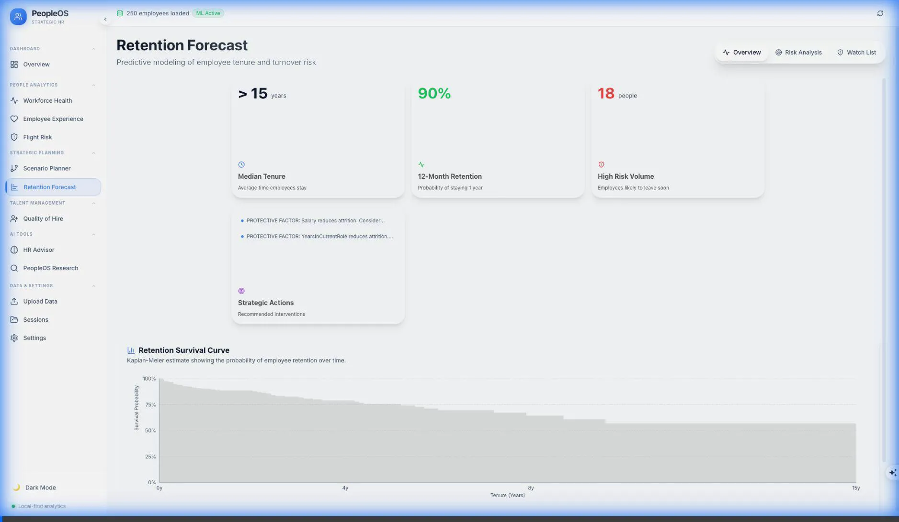

# PeopleOS: Strategic People Analytics Platform

PeopleOS is a **local-first, privacy-preserving Strategic People Analytics** platform designed for People Operations and HR leaders. 

Unlike traditional cloud tools, PeopleOS runs entirely on your local machine. This means your sensitive employee data (salary, performance, personal details) **never leaves your environment**, ensuring maximum data privacy and GDPR/PII compliance by design.

---

## 🚀 Key Benefits for People Operations

*   **Retention Forecasting**: Move beyond historical turnover rates. Predict which employees might be at risk over the next 12 months using advanced mathematical "Survival" models.
*   **Quality of Hire Analysis**: Identify which recruitment sources (LinkedIn, Referrals, etc.) provide the highest-performing and most loyal employees.
*   **Strategic AI Advisor**: Get executive-level summaries and actionable recommendations powered by a local AI engine (no external data sharing).
*   **Workforce Health Mapping**: Visualize department-level health, pay equity, and promotional gaps in a single, premium dashboard.


---

## 🛠 Features

### 1. Retention Forecast (Predictive)


*   **At-Risk Employee Watchlist**: See who is most likely to depart and why.
*   **Risk Factors**: Understand the "drivers" behind departures (e.g., tenure stagnation, pay gaps, or performance trends).
*   **Survival Curves**: Graphically see how long different groups (e.g., Departments or Hire Sources) typically stay with the company.

### 2. Quality of Hire (Diagnostic)


*   **Source ROI**: Compare the value of different hiring channels.
*   **Interview Predictors**: Identify which interview dimensions (Technical, Cultural, Leadership) actually correlate with long-term performance.
*   **New Hire Watch**: Monitor the health and integration of recent arrivals.

### 3. Workforce Health (Descriptive)
*   **Headcount & Turnover**: Real-time tracking of team movements.
*   **Pay Equity**: Instant identification of gender or departmental pay gaps.
*   **Tenure Tracking**: Monitor "role stagnation" to prevent burnout.

### 4. Strategic Advisor (Prescriptive)


*   **Executive Briefings**: AI-generated reports that summarize your workforce data into strategic bullet points.
*   **Smart Actions**: Categorized recommendations (Immediate, Strategic, Cultural) to improve team health.

### 5. Advanced Analytics (Enterprise-Grade ML)

*   **Causal Inference**: Answer "What-If" questions like *"If we increase salary by 10%, will turnover decrease?"* using DoWhy.
*   **Organizational Network Analysis (ONA)**: Identify key influencers and connectors whose departure would impact operations.
*   **Workforce Segmentation**: AI-driven employee personas ("Star Performers", "At-Risk Veterans") for targeted interventions.
*   **Trend Forecasting**: 12-month projections for headcount and average salary using Holt-Winters time series.

---

## 🔒 Privacy & Security (The "Local-First" Advantage)

PeopleOS was built for maximum security:
- ✅ **Zero Cloud Dependency**: Data is processed only on your machine.
- ✅ **No External AI Usage**: AI insights are generated locally (via Ollama).
- ✅ **Automatic Redaction**: Sensitive PII is automatically handled securely.
- ✅ **Git-Safe**: The default configuration (via .gitignore) ensures you never accidentally push your `peopleos.db` or employee CSVs to GitHub.

## 📋 Is PeopleOS Right for Your Organization? (Readiness Checklist)

PeopleOS is designed for organizations with a certain level of data maturity. Use this checklist to see if you are ready to achieve high-integrity results:

### 1. Data Maturity (The "Fuel")
- [ ] **Historical Depth**: At least 12–24 months of attrition and performance records.
- [ ] **Data Hygiene**: Consistent records for Job Levels, Salary, and Manager IDs.
- [ ] **Outcome Integrity**: Clear distinction between Voluntary and Involuntary attrition.

### 2. Technical Infrastructure (The "Engine")
- [ ] **Hardware**: A machine with 16GB+ RAM to run local AI (Ollama).
- [ ] **Privacy Approval**: Internal approval for a local-first, zero-cloud architecture.

### 3. Cultural Readiness (The "Pilot")
- [ ] **Supportive Intervention**: Using AI for conversations, not automated punitive actions.
- [ ] **Probabilistic Thinking**: Comfort with making decisions based on risk percentages.

> [!TIP]
> **Not ready yet?** You can still use PeopleOS for workforce visualization and historical analytics while you build up the data depth required for advanced forecasting.

---

## 💻 Setup Guide (For IT/Admins)

To get started, your machine needs **Python 3.10+** and **Node.js 18+**.

### 1. Install Dependencies
```bash
# Install backend requirements
pip install -r requirements.txt

# Install frontend UI
cd web
npm install
cd ..
```

### 2. Strategic AI Engine (Optional)
Install [Ollama](https://ollama.ai) and run:
```bash
ollama serve
ollama pull gemma3  # Or your preferred local model
```

### 3. Launching the Platform
Run the following in two separate terminal windows:

**Window 1 (Backend Engine):**
```bash
uvicorn api.main:app --host 0.0.0.0 --port 8000
```

**Window 2 (User Interface):**
```bash
cd web
npm run dev
```

Visit `http://localhost:3000` to start your analysis.

---

## 📊 Data Integration Guide

PeopleOS uses a "Golden Schema" for data mapping. You can download a **Sample Template** directly from the **Data Center** within the application to see the expected format.

### Required Fields:
- `EmployeeID`, `Dept`, `Tenure`, `Salary`, `LastRating`, `Age`

### Optional (Enables Advanced Features):
- `Attrition`: Required for Retention Forecasting.
- `PerformanceText`: Required for AI-powered sentiment analysis.
- `HireSource`, `InterviewScores`: Required for Quality of Hire analytics.

---

## 📜 Version History
### v1.2.0 (Latest)
- **Enhanced UX**: HR-friendly terminology and "Why this matters" explainers.
- **Deep-Dive Modals**: Individual risk breakdown for New Hires.
- **Data Center**: Downloadable CSV templates for easy onboarding.
- **Improved Performance**: XGBoost integration for more accurate flight-risk detection.

---

## ⚖️ License

**Apache License 2.0 with Commercial Use Restriction**

Copyright (c) 2024-2026 Omoniyi Ipaye.

Licensed under the Apache License, Version 2.0 (the "License"); you may not use this file except in compliance with the License. You may obtain a copy of the License at

    http://www.apache.org/licenses/LICENSE-2.0

**COMMERCIAL USE RESTRICTION:**
Notwithstanding the terms of the Apache License 2.0, **any use of this software for commercial purposes is strictly prohibited without the express written permission of Omoniyi Ipaye.**

Commercial purpose includes, but is not limited to:
*   Using the software to provide paid services to third parties.
*   Selling, licensing, or renting the software.
*   Integrating the software into a commercial product.
